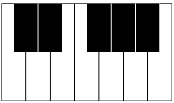

This is just a short addition to the simple synthesizer I've been working on in JavaScript.  While it's
obviously more convenient to use a MIDI Controller to interact with it, presumably the average person
reading this out of curiosity doesn't have one.  So, why not make it more accessible to them?  Thus,
we'll be adding a simple, one octave virtual keyboard that can be controlled with the mouse or keyboard.

So the first thing I wanted to do was create an actual visual keyboard.  First, let's create a new function,
which I'll call VirtualKeyboard.

```javascript
import React from "react";

const VirtualKeyboard = () => {

}

export default VirtualKeyboard;
```

We'll have to draw the keys.  So let's think about what keyboard keys look like, and try to replicate that.
Let's make a CSS file to create those styles.  We'll reserve a bit of screen space for the keyboard.

```css
#virtual-keyboard {
	height: 250px;
}
```

We have to include this CSS file, so we'll add this to our Virtual Keyboard.

```javascript
import "../styles/synthesizer.css";
```

And then create the initial div.

```javascript
<div id="virtual-keyboard"></div>
```

We have to consider how to create the keys.  I decided to have this not only be for positioning the key,
but also for determining the note that's been hit.  Since this is just a single octave, we'll start with
middle C and work from there.

```javascript
keys = [
	{ note: "C", frequency: 261.6 },
	{ note: "C#", accidental: true, frequency: 277.2 },
	{ note: "D", frequency: 293.7 },
	{ note: "D#", accidental: true, frequency: 311.1 },
	{ note: "E", frequency: 329.6},
	{ note: "F", frequency: 349.2},
	{ note: "F#", accidental: true, frequency: 370},
	{ note: "G", frequency: 392},
	{ note: "G#", accidental: true, frequency: 415.3},
	{ note: "A", frequency: 440},
	{ note: "A#", accidental: true, frequency: 466.2},
	{ note: "B", frequency: 493.9}
]	
```

We'll add a little something to our virtual keyboard to actually create the keys.

```javascript
let createVirtualKeyboard = () => {		
	return (
		<div id="virtual-keyboard">
			{keys.map((key, index) => {
				return (
					<div className={"key" + (key.accidental ? " accidental" : "")}>
					</div>
				)
			})}
		</div>
	);
}
	
return createVirtualKeyboard();
```

This will iterate through the keys above and print them out, adding an "accidental" class to indicate our
sharps and flats.  If we look at an actual piano or keyboard, we know that the accidentals (black keys)
fall in between the naturals (white keys), so we want to replicate this.  First, we'll create some styles.

```css
.key {
	height: 200px;
	width: 50px;
	border: 1px solid #000000;
	position: absolute;
	z-index: 1;
}

.key.accidental {
	height: 100px;
	border: 1px solid #ffffff;
	border-top: 1px solid #000000;
	background-color: #000000;
	z-index: 2;
}
```

The accidental keys are smaller than the naturals, so we make them about half as tall, although we don't
perfectly replicate it as we're not changing the width.  We also make sure to color the accidentals black.
Since there will be some overlap here, I made the z-index higher on the accidentals so that the click events
won't become an issue.  Now, everything here will still overlap and look ugly, so we need to actually decide
the spacing.

I wanted it to start at about 450 pixels from the left, so I added this to the createVirtualKeyboard function:

```javascript
let keyPosition = 450;
```

We're just initializing a variable here - our starting point.  Let's add the style parameter to our keys, and
add a way to loop over the keys.

```javascript
{keys.map((key, index) => {
	keyPosition += (index === 5 ? 50 : 25);
	return (
		<div className={"key" + (key.accidental ? " accidental" : "")} style={{ left: keyPosition + "px"}}></div>
	)
})}
```

The reason for the calculation there is because there isn't a corresponding accidental for each natural, so we
need to skip it when we go from E to F.

Okay, so now we have something that should be looking like a keyboard!



Of course, this.. still doesn't do anything!  So let's bring in the actual MIDI Synthesizer.

```javascript
import MIDIInput from "../components/midiControlledSynth"

let midiInput = new MIDIInput();
```

Now we can use it much like the last article - let's create functions to respond to the button clicks.

```javascript
let keyPressed = (frequency) => {
	midiInput.playSound(frequency);
}
	
let keyReleased = () => {
	midiInput.stopSound();
}
```

We have to be mindful that if we just do an onClick event, the sound will start playing and it'll never stop.  So
instead we're going to use onMouseDown and onMouseUp.  Let's add this to our keys.

```javascript
<div onMouseDown={() => keyPressed(key.frequency)} onMouseUp={keyReleased}
	 className={"key" + (key.accidental ? " accidental" : "")} 
	 style={{ left: keyPosition + "px"}}>
</div>
```

Because we created a key structure earlier that has the frequencies, this will give us the ability to actually
play notes.  Give it a try!  Now, try pressing down on a key, and then moving the mouse away from it.  What
happens?  Well, the sound keeps playing, because it doesn't pick up the onMouseUp event.  So let's add an
onMouseLeave event to capture this scenario.

```javascript
<div onMouseDown={() => keyPressed(key.frequency)} onMouseUp={keyReleased}
	 onMouseLeave={keyReleased}
	 className={"key" + (key.accidental ? " accidental" : "")} 
	 style={{ left: keyPosition + "px"}}>
</div>
```

Now we're in business.  With the mouse input finished, we can move on to the keyboard input.  We'll have to
add an event to the document to capture the key presses.  But we only care about a subset of the keys on the
keyboard.

```javascript
document.onkeydown = (e) => {
	let buttonCodes = ["KeyA","KeyW","KeyS","KeyE","KeyD","KeyF","KeyT","KeyG","KeyY","KeyH","KeyU","KeyJ"];
	let buttonCodeIndex = buttonCodes.indexOf(e.code);

	if(buttonCodeIndex !== -1) {
		let selectedKey = keys[buttonCodeIndex];
		keyPressed(selectedKey.frequency);
	}
}

document.onkeyup = (e) => {
	keyReleased();
}	
```

So what are we doing here?  Well, to start, we want to kind of simulate using a piano/keyboard on our, well, keyboard.
For this, we're going to use the keys ASDFGHJK for the naturals and WETYU for the accidentals.  It'd be a hassle to
put in a switch statement to deal with each button press and map it to a key, so instead I've made an array with the
keyCodes in the same order as the keys in our original keys structure.  This means, when a button is pressed, we can
just search for that value in the array, get the index, and then choose the same key in the key structure.  Any other
buttons are ignored.  After we have it, we can then play the frequency associated with that key.

Similarly, we don't want the note to sound forever, so we have an onkeyup event to stop the playback when we lift the key.

And that's it!  Now we can noodle around with this simple synth without needing a MIDI Controller.  As always, you
can find the code for this on [Github](https://github.com/dwalizer/WebMIDIInput), and you can try the synthesizer out [here](/synthesizer).