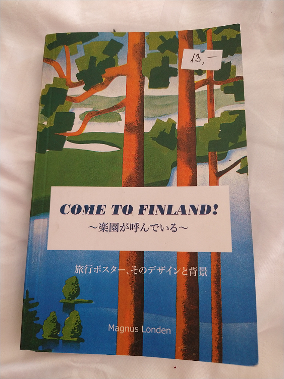

Time really has a way of getting away from you, I gotta say!  This is my first blog entry in close
to two years.  In truth, I thought about writing one this time last year, but I just.. kinda.. didn't.
And then before I knew it, it was 2023.  Crazy how that works.  It was even a bit of trouble to
actually get the blog to build properly, after all of the necessary updates and what not.

##The Story So Far

There's a lot to catch up on, I guess.  I've moved on to other work, jumping from working primarily in
React, to having to work with some old school style JavaScript in an older framework I dare not name,
to working primarily in Java and Vue, which is not terribly different from React.  I have not yet
decided if I prefer it over React, though it certainly has some nice aspects to it.  I traveled a bit.
I ate a lot of food.  I returned to practicing Muay Thai.  I took the JLPT twice (N3 and N2).  I took
a crack at more languages, and I forgot how to boulder.

##On the JLPT

As I just noted, I took the JLPT twice - I took the N3 at the end of 2021 and the N2 at the end of 2022.
The results for the N2 have not yet been released, so I have no idea how that one went, but I don't feel
great about it.  However, I did manage to pass the N3 and felt pretty good about my chances of doing so
the moment I left the test room.  I prepared for each exam a bit differently, but I can't really say if
the methods I used significantly impacted how the exams went.

When studying for the N3, I primarily went through two different book groups: Nihongo so-matome and Shin Kanzen
Master.  Both had their pros and cons, I think, but overall I think Shin Kanzen Master was probably
the better set of books in terms of how rigorous the material was.  Nihongo so-matome is much more
approachable, organized into bite sized bits meant to be completed daily over several weeks.  That being
said, neither book series really felt like it prepared me in terms of what was actually covered on the
exam, but that's no fault of the books themselves, since you never really know what the exam will
actually cover.  Nevertheless, working through Shin Kanzen Master in the months leading up to the test
probably did quite a bit to get me used to the reading sections on the exam.

In addition to those two books, I spent a decent amount of time watching Japanese speaking YouTubers
and Japanese television when I could, as well as reading something like 50 manga in Japanese.

For the N2 however, while I did start out with Shin Kanzen Master, I instead opted to use Nihongo so-matome
and the Try! N2 book (which are from the same publisher, I believe).  As opposed to preparing for the
N3, where I just worked through those workbooks, after I finished working through Nihongo so-matome, I
went through Try! N2 and took extensive notes on all of the grammar points covered in that book,
referencing many of them in the appropriate Dictionary of Japanese Grammar to get a better idea of the
grammar, the nuances, etc.  Those dictionaries are a bit expensive but honestly worth every penny.

Despite the more extensive grammar studying I did for the N2, I did far less reading in the leadup to
the N2 exam and I think that certainly hurt me.  My goal for 2022 had been to read at least one novel
in Japanese, and I unfortunately didn't pull that off (I'm still working my way through コンビニ人間).
So that's a goal that's ended up being moved to 2023.  In the leadup to the exam, I began to feel
kind of like I was somehow understanding less of the language, despite having weekly conversations with
a teacher and a conversation partner/tutor that generally went well.  I was probably suffering from
some sort of burnout and was hoping to push through it until I crossed the finish line.  I think this
definitely impacted me on the test day, as I was feeling rather unfocused.

So I think it's unlikely I passed the N2, but I'm still quite pleased that I passed the N3, and I'm
pleased with the progress I've made even if I didn't achieve my goal of passing the N2.  While I'm
still putting some time into studying, I'm taking time to just enjoy the language again for a while.

##Travel and Other Languages

In 2022, I was fortunately able to do a bit of traveling, most notably to Iceland and Finland.  In
the lead up to the trip, I decided to learn a little bit about the Icelandic language and the
Finnish language, even though I knew they wouldn't be necessary to navigate things there.  I've
spent some time in the past learning Norwegian and I find it to be a really interesting language,
and it came in handy for learning a bit of Icelandic.  Finnish, of course, is an entirely different
challenge, but a very neat language that I've not made much progress in.  I did find an interesting
little book about Finland, written in Japanese, however.

I've been studying Korean for a while, but I let that lapse quite a bit in 2022 due to a combination
of being busy and being lazy.  Evidently I had been writing a post on Korean verb endings before I
took a hiatus from blogging.  Go figure.  I intend to get back to that pretty strongly in 2023.  It
also turns out I can still kinda sorta speak Spanish.

##Linguistics?

Recently I've become more interested in the topic of Linguistics and also Computational
Linguistics.  It's not really something I had the opportunity to interact with when I was studying
Computer Science in undergrad or grad school, although I did have some courses in AI.  Still,
both fields are something I'm hoping to learn more about in 2023 as I bring these two different
aspects of my life together.  I have two books on Linguistics that I need to read / finish, and
recently I've purchased another book on Japanese Linguistics, which I'm looking forward to reading.

##Hobbyist Development

I've kind of neglected doing any sort of programming outside of my regular profession this last year,
and I'd like to change that in 2023, though I haven't quite decided what that'll look like in
practice.  I'd like to get back to messing around with some of my WonderWitch stuff and maybe
finish work on the boxing round timer app I had been writing.  There are always some ideas
kicking around in my head for other pet projects, so maybe I'll try bringing one of those to fruition.

##Wrap Up

Well, this is a bit long, I think, so I might as well wrap it up.  2022 was a very eventful year
and I'm hopeful that 2023 will also bring a lot of new challenges and interesting adventures. And,
hopefully, more than just this blog post.  I have a few things planned for the year that aren't
far enough along to write about, but once they are, I'll certainly probably maybe write about them.