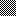

Recently I've been working on getting actual sprite / image data to display with
WonderWitch, which will be the subject of a future blog once I actually finish it.
You can use BMP files with the WonderWitch, apparently, and while trying to do so,
I decided it would be helpful to better understand the BMP file format.  So, to start,
I made a simple, 16x16, monochrome image, that looks like this.



Of course, if you actually look at this, you'll see it's a PNG file.  That's because
BMP was unsupported, for whatever reason, in Markdown or Gatsby or somewhere.  It wasn't
important enough for me to investigate.  Anyway, let's take a look at what this
checker pattern actually looks like by opening it up in a hex editor.

```
Address | 0| 1| 2| 3| 4| 5| 6| 7| 8| 9| a| b| c| d| e| f
00000000|42 4d 7e 00 00 00 00 00 00 00 3e 00 00 00 28 00
00000010|00 00 10 00 00 00 10 00 00 00 01 00 01 00 00 00
00000020|00 00 40 00 00 00 00 00 00 00 00 00 00 00 00 00
00000030|00 00 00 00 00 00 00 00 00 00 ff ff ff 00 aa aa
00000040|00 00 55 55 00 00 aa aa 00 00 55 55 00 00 aa aa
00000050|00 00 55 55 00 00 aa aa 00 00 55 55 00 00 aa aa
00000060|00 00 55 55 00 00 aa aa 00 00 55 55 00 00 aa aa
00000070|00 00 55 55 00 00 aa aa 00 00 55 55 00 00
```

So this all looks like a bunch of nonsense right now, I'm sure.  To make sense of it,
we'll need to look at the file format itself.  There's a really great chart hosted
[here](http://www.ece.ualberta.ca/~elliott/ee552/studentAppNotes/2003_w/misc/bmp_file_format/bmp_file_format.htm).
Let's go through the file format here.  First, we start off with a 14 byte header, so
we grab the first 14 bytes of our hex dump.

```
Signature | File Size   | reserved    | Data Offset
  42 4d   | 7e 00 00 00 | 00 00 00 00 | 3e 00 00 00
```

If your hex editor displays a dump next to the hex values, you will likely see the first
two characters "BM", which matches what we're told about on the table - that's the signature.
The next 4 bytes are the file size, which says 7e - we can see that the hex dump ends at 7d, and
7e in decimal is 126, which is how many bytes the file takes up.  The reserved section is unused,
so we can skip on past that.  Finally we see the data offset - 3e.  You can look ahead at that
address in the hex dump, which according to the table is the offset from the beginning of the file
to the bitmap data.

Next, we have a 40 byte Info Header.  So let's grab the next 40 bytes and take a look at those.

```
Size        | Width       | Height      | Planes | Bits Per Pixel
28 00 00 00 | 10 00 00 00 | 10 00 00 00 | 01 00  | 01 00         

Compression | Image Size  | XpixelsPerM | YpixelsPerM
00 00 00 00 | 40 00 00 00 | 00 00 00 00 | 00 00 00 00

Colors Used | Important Colors
00 00 00 00 | 00 00 00 00
```

The Size data there refers to the size of the info header - 28h is 40, and we already know that
the info header is 40 bytes.  The following height and width refer to the size of the image itself.
We know the image is 16x16, and we can see both are 10 00 00 00, which would be 16.  I don't
really know what Planes is for, but it's equal to 1.  Now we get to Bits Per Pixel.  Previously, I
said this was a monochrome image.  According to the table, the possible values are:

```
1 = monochrome / 1 color
4 = 4 bit palletized / 16 colors
8 = 8 bit palletized / 256 colors
16 = 16 bit RGB / 65,536 colors
24 = 24 bit RGB / 16 million colors
```

The value is 01 00, which lines up with the image being monochrome.  We have no compression on this,
so the compression bytes are 0.  The image size is 40h, or 64 in decimal.  We know this file is
126 bytes, minus 54 bytes for the header and info header, minus an additional 8 bytes for the color table
(which is going to be covered in a second) and we get 64 bytes.  Everything is looking good so far.

Now, the color table that follows - if we look at the table again, it notes that the color table is
only present if Info.BitsPerPixel is less than 8 - which, in our case, it is (it's only 1).  The
colors are also ordered by importance.  So our color table is:

```
Red | Green | Blue | Reserved 
00    00     00      00

Red | Green | Blue | Reserved
ff    ff     ff      00
```

We have 00 00 00 first and then ff ff ff second.  These correspond with white and black respectively,
so that makes sense.  It also puts us at the offset 003e, which is where the file earlier said the
bitmap data would begin.  Alright!  Now we're at the actual pixel data of the image.

```
aa aa 00 00 
55 55 00 00
aa aa 00 00 
55 55 00 00
aa aa 00 00 
55 55 00 00
aa aa 00 00 
55 55 00 00
aa aa 00 00 
55 55 00 00
aa aa 00 00 
55 55 00 00
aa aa 00 00 
55 55 00 00
aa aa 00 00 
55 55 00 00
```

Outside of the hex dump's formatting, we can see that this information has a clear pattern to it, which
makes sense considering it's just a checker pattern.  It's important to know **that bitmaps draw from the
bottom left up**, so the first line of our data actually corresponds to the bottom line of the image.  Note
that I broke this down into 16 lines - that's because every 4 bytes represents a line in the image.  This
might sound a bit confusing.  But let's take a look at the binary for aa and 55.

```
aa = 1010 1010
55 = 0101 0101
```

Oh hey there's something of a pattern there, huh.  Looks kind of like a checkerboard.  Now things are starting
to make sense.  Earlier we noted that the bits per pixel is 1 - this makes sense, since it's monochrome
and we can basically look at it as being **on** or **off**.  As such, that means the first two bytes of each
line will represent the full 16 pixels of that line, hence:

```
aa aa 00 00 	1010 1010 1010 1010 0000 0000 0000 0000
55 55 00 00     0101 0101 0101 0101 0000 0000 0000 0000
```

And now we start to see a checker pattern emerge in the binary.  If you want to see how these values
actually change things in practice, try replacing the first aa in the pixel data with 55, save it,
and reload the image - you should notice that the first 8 pixels on the bottom left of the image have
flipped.  If you change the next aa to 55, you'll see the same thing with the second half of that
line.  For some real fun, consider some different patterns in the binary, then replace the value with
that hex value.  For instance, 1111 0000 should give us 4 pixels blank and then 4 filled - this is hex
value F0.  On the other hand, 0F will flip it the opposite way.  Now we know how to build and
understand a monochrome bitmap without using paint software.

While tinkering around with this and doing a bit of additional research, I found a great walkthrough
on this at Medium, located [here](https://medium.com/sysf/bits-to-bitmaps-a-simple-walkthrough-of-bmp-image-format-765dc6857393).

Maybe next, I'll try messing with images that have a bit more color.