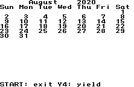
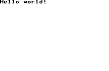

Now that the connection between the WonderSwan and the PC has been established, it's time
to actually get our hands dirty with some code.  Step one will be to compile one of the
programs from the samples folder.  Since we're working with C, we're going to need to use
Make for these Makefiles.

##Installing Make and Configuring the Environment

First, we have some additional setup to do.  In the WonderWitch install folder, there's a
**bin** subfolder which holds a number of executables, including the previously mentioned
TransMagic.  If we take a look at that folder, and take a look at the **setup.bat**.  This
shows some changes being made to the environment variables.  You can run **setup.bat**,
which will add the WonderWitch folders to your path, but, if you installed WonderWitch
to any folder other than C:\WWitch, this won't do anything for you.  If so, you'll need
to open up the setup.bat file and change the paths to reflect your WonderWitch install.

You might find that these path variables don't persist between sessions - if so, you'll
probably want to go add them manually as environmental variables in Windows.

With this step completed, we'll have access to a number of binaries, including **kmmake**.
To verify, you can run kmmake and see if it finds hte command.  If you don't want to use
**kmmake** for some reason, we can use [GNU Win32 Make](http://gnuwin32.sourceforge.net/packages/make.htm),
which you'll need to install and then add to your path as well.

Either way, in a new terminal window, you should now be able to type the **make** command,
**kmmake** command, or the **mkfent** command (which is a WonderSwan binary).
If you run **mkfent**, you should see something like this in the terminal:

    mkfent Version 1.02 (c) 2000 Qute Corp.
    usage: mkfent <config file>
           mkfent -f <file>
           mkfent -r|-i <.fx file>

This means we've successfully added the WonderWitch binaries to the path.

##A note about MiracleMage

Even though we setup the connection between the WonderSwan and the PC in the previous section,
some people might consider it to be a hassle to actually build, copy to the WonderWitch and
then run.  In this case, someone did develop a WonderWitch emulator called MiracleMage, so
that might be worth investigating and trying.  I've only dabbled with it a little bit, and
it seemed to work fine with some of the provided samples that I compiled, but didn't want
to run any of the WWGP2001 files, so your mileage may vary.

##Let's compile!

To make sure everything is working right, it's time to actually build something.  There are
a lot of code samples in the samples folder.  You can pick probably whichever one you want,
but for the sake of simplicity, we'll use the calendar program that's provided
in the _calender_ folder.

There are a number of files provided in this folder.  The most noteworthy one is the one that
ends with **.fx**.  This is the extension for the files output from our builds, that we'll
then load up in WonderWitch.  There's probably already a calendar.fx in this folder.  You can
safely delete this, since these samples are safely backed up on the Magical CD-ROM.  If you
don't, there won't actually be anything to make.  Now, go ahead and run the **make** command.
The output should look like:

    mkfent calendar.cf
    mkfent: calendar.fx 1362 bytes (11 blocks)

If you look at the file listing, you'll see calendar.fx has returned.  Either copy this to
the WonderWitch or use the aforementioned emulator to load it up.  If everything worked,
you should see something like this.

So, we've at least successfully run **make** to create a file that can be run on the WonderSwan.
But, we didn't really build this - most of the work had already been done for us, so really it
was just running the **mkfent.exe** command.  If you take a look at the included makefile, you'll
see that there are several files built - **calendar.obj**, **calendar.bin**, **calendar.fx**, and
a reference to **makefile.inc** in the parent folder.  **makefile.inc** is really where the meat
of everything is.  If you open up that file, you can see the commands that are actually used
to build our file.

Let's, instead, go back to basics.  Let's start with a simple Hello World program, called hello.c.

    #include <sys/bios.h>

    void main() {
        text_screen_init();
        text_put_string(0, 0, "Hello world!");
    }

Now, from our working folder, we'll need to run the command:

    lcc86 -o hello.bin hello.c

You'll probably get an output something like this:

    hello.c 1: can't open: sys/bios.h: No such file or directory

Well, we didn't include the necessary files from WonderWitch, so that's not surprising.
If we run lcc86 with no arguments, we see:

    LSI C-86 cross Compiler ver 3.5.12 for WonderWitch [Apr 14 2000]
    Copyright (C) 1995-1999 by LSI JAPAN CO., LTD. All Rights Reserved.

    ---- S-Model ONLY ----
    Usage: lcc86 [-afile][-c][-Dname[=value]][-g][-h][-Idir][-jN]
                [-k linkopt][-llibrary][-Ldir][-m][-mslink]
                [-nX][-noconf][-nomslink][-o output][-O][-p][-S[C]]
                [-Tdir][-vN][-wN][-Xdir][-yN][-z]
                sourcefile...

    sourcefile: one of: *.c *.a86 *.asm *.obj *.lib

So the two options of note here are -Idir and -Ldir.  We're going to need to use -I to
include the necessary includes, and -L to include some additional libraries in a moment.
The includes can be found under the **include** folder in your WonderWitch install folder.
So we update the command to:

    lcc86 -IC:\Development\WWitch\include\ -o hello.bin hello.c

When you run this, you'll likely get some complaints about a missing object.  So we'll add
the lib folders from WWitch\lib and WWitch\lsic86ww\lib\s.

    lcc86 -IC:\Development\WWitch\include\ -LC:\Development\WWitch\lib\ -LC:\Development\WWitch\lsic86ww\lib\s\ -o hello.bin hello.c

Running this command, we'll finally get a successful **hello.bin** output.  But we're
still not done.  We still need to turn this bin file into something that can actually
run on the WonderWitch.  So now we have to make another file, called **hello.cf**:

    name: hello
    info: hello
    mode: 7
    source: hello.bin
    output: hello.fx

And now, we can run the **mkfent** command:

    mkfent hello.cf

This should tell us it created the **hello.fx** file.  We'll go ahead and copy this to
the WonderWitch, or load it up on the emulator, and execute it.

And that's it!  We've created, compiled and run our first WonderWitch file.  But that
command is kind of unwieldy, so let's make a quick makefile to automate this.

    WWITCH=C:\Development\WWitch

    WWITCH_INCLUDES = $(WWITCH)\include
    WWITCH_LIB = $(WWITCH)\lib
    LSIC_LIB = $(WWITCH)\lsic86ww\lib\s

    default:
        lcc86 -I$(WWITCH_INCLUDES) -L$(WWITCH_LIB) -L$(LSIC_LIB) -o hello.bin hello.c
        mkfent hello.cf

This is just a quick and dirty makefile.  Obviously WWITCH would need to be whatever path
you've installed to.  But that's all there is to it.

You can check out the code and the finished **.fx** file for this article on my [GitHub](https://github.com/dwalizer/wonderwitch)