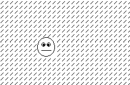

It's been a little while since I've been able to revisit the WonderWitch, but the last time
I was working with it, I was working towards displaying an actual image on the screen instead
of just writing text.  So, first, we'll need an image.


So here's a smiley.  Well.  Not really much of a smile.  In any case, this is a 32x32 monochrome BMP.
Now that we have an image to work with, we're going to have to convert it into a resource that
we can use with the WonderWitch.  Including with the tools is an executable called **bmpcnv.exe**.
If you put the folder with these binaries in your path, you should be able to run this from your
working directory.  Now, if you run it with no parameters, you'll see output like this.

```bash
Freya Image resource converter Version 2.01 (c) 2000 Qute Corp.
usage: bmpcnv [options] <bmp file(.bmp)> [resource file(.fr)]
       bmpcnv -c[format file] <bmp file(.bmp)> [output file(.h)]
options: -t<type> : resource type
         -d<id>   : resource ID number
         -e       : append FBFF header
         -p<pal>  : assign palette color
         -m<mode> : convert 16 colors bmp (for WWC only)
             mode - b0 : 0=planar,  1=packed
                    b1 : 0=16color, 1=15color(palette#0 is color key)
```

For our purposes, we're going to format this and get a **.h** file for it, which will basically
put the image data into a structure that we can easily import into our class.  To actually use
this converter, however, you'll need a format file.  In the source code for **bmpcnv**, you can find
one such format file, which looks like this:

```c
#define %s_width %d
#define %s_height %d

unsigned %s bmp_%s[] = {
```

That's all there is to it.  Now, assuming our file is called smile.bmp and our format file is just
called format, we can run this command:

```bash
bmpcnv -cformat smile.bmp smile.h
```

If this is successful, we'll have a header file called smile.h.  Let's take a look at this resulting
file.

```c
#define smile_width 4
#define smile_height 4

unsigned char bmp_smile[] = {
	0x00, 0x00, 0x00, 0x01, 0x02, 0x04, 0x08, 0x10, 
	0x07, 0x38, 0xC0, 0x00, 0x00, 0x00, 0x00, 0x00, 
	0xF0, 0x0C, 0x03, 0x00, 0x00, 0x00, 0x00, 0x00, 
	0x00, 0x00, 0x00, 0x80, 0x40, 0x20, 0x10, 0x08, 
	0x10, 0x20, 0x20, 0x20, 0x40, 0x40, 0x40, 0x40, 
	0x38, 0x44, 0x9A, 0xBE, 0xBE, 0x5C, 0x38, 0x00, 
	0x1C, 0x22, 0x59, 0x7D, 0x7D, 0x3A, 0x1C, 0x00, 
	0x08, 0x04, 0x04, 0x04, 0x02, 0x02, 0x02, 0x02, 
	0x40, 0x40, 0x40, 0x40, 0x20, 0x20, 0x20, 0x10, 
	0x00, 0x00, 0x00, 0x00, 0x00, 0xFF, 0x00, 0x00, 
	0x00, 0x00, 0x00, 0x00, 0x00, 0xFF, 0x00, 0x00, 
	0x02, 0x02, 0x02, 0x02, 0x04, 0x84, 0x04, 0x08, 
	0x10, 0x08, 0x04, 0x02, 0x01, 0x00, 0x00, 0x00, 
	0x00, 0x00, 0x00, 0x00, 0x00, 0xC0, 0x38, 0x07, 
	0x00, 0x00, 0x00, 0x00, 0x00, 0x03, 0x1C, 0xE0, 
	0x08, 0x10, 0x20, 0x40, 0x80, 0x00, 0x00, 0x00, 

};
```

So we see there's a width and a height already set for us, and then the data for the image we used.
Just for the sake of better understanding what possibly went on with this conversion, let's take a look
at the hexdump for the original image.

```
42 4d be 00 00 00 00 00 00 00 3e 00 00 00 28 00
00 00 20 00 00 00 20 00 00 00 01 00 01 00 00 00
00 00 80 00 00 00 00 00 00 00 00 00 00 00 00 00
00 00 00 00 00 00 00 00 00 00 ff ff ff 00 ff f8
1f ff ff c7 e3 ff ff 3f fc ff fe ff ff 7f fd ff
ff bf fb ff ff df f7 ff ff ef ef ff ff f7 ef ff
ff f7 df ff ff fb df 00 00 7b df ff ff fb bf ff
ff fd bf ff ff fd bf ff ff fd bf ff ff fd bf ff
ff fd bf c7 e3 fd bf a3 c5 fd bf 41 82 fd df 41
82 fb df 65 a6 fb df bb dd fb ef c7 e3 f7 ef ff
ff f7 f7 ff ff ef fb ff ff df fd ff ff bf fe ff
ff 7f ff 3f fc ff ff c7 f3 ff ff f8 0f ff
```

Note: I had to hand type this, so hopefully it's accurate!  Looking back at the previous article on
[Understanding the BMP file format](/understanding-bmp/), we can figure out what the different chunks
of this file are.

```
Signature | File Size   | Reserved    | Data Offset
  42 4d   | be 00 00 00 | 00 00 00 00 | 3e 00 00 00

Size        | Width       | Height      | Planes | Bits Per Pixel
28 00 00 00 | 20 00 00 00 | 20 00 00 00 | 01 00  | 01 00

Compression | Image Size  | XpixelsPerM | YpixelsPerM
00 00 00 00 | 80 00 00 00 | 00 00 00 00 | 00 00 00 00

Colors Used | Important Colors
00 00 00 00 | 00 00 00 00

Red | Green | Blue | Reserved
00  | 00    | 00   | 00

Red | Green | Blue | Reserved
ff  | ff    | ff   | 00

Pixel Data
ff f8 1f ff | 1111 1111 1111 1000 0001 1111 1111 1111
ff c7 e3 ff | 1111 1111 1100 0111 1110 0011 1111 1111
ff 3f fc ff | 1111 1111 0011 1111 1111 1100 1111 1111
fe ff ff 7f | 1111 1110 1111 1111 1111 1111 0111 1111
fd ff ff bf | 1111 1101 1111 1111 1111 1111 1011 1111
fb ff ff df | 1111 1011 1111 1111 1111 1111 1101 1111
f7 ff ff ef | 1111 0111 1111 1111 1111 1111 1110 1111
ef ff ff f7 | 1110 1111 1111 1111 1111 1111 1111 0111
ef ff ff f7 | 1110 1111 1111 1111 1111 1111 1111 0111
df ff ff fb | 1101 1111 1111 1111 1111 1111 1111 1011
df 00 00 7b | 1101 1111 0000 0000 0000 0000 0111 1011
df ff ff fb | 1101 1111 1111 1111 1111 1111 1111 1011
bf ff ff fd | 1011 1111 1111 1111 1111 1111 1111 1101
bf ff ff fd | 1011 1111 1111 1111 1111 1111 1111 1101
bf ff ff fd | 1011 1111 1111 1111 1111 1111 1111 1101
bf ff ff fd | 1011 1111 1111 1111 1111 1111 1111 1101
bf ff ff fd | 1011 1111 1111 1111 1111 1111 1111 1101
bf c7 e3 fd | 1011 1111 1100 0111 1110 0011 1111 1101
bf a3 c5 fd | 1011 1111 1010 0011 1100 0101 1111 1101
bf 41 82 fd | 1011 1111 0100 0001 1000 0010 1111 1101
df 41 82 fb | 1101 1111 0100 0001 1000 0010 1111 1101
df 65 a6 fb | 1101 1111 0110 0101 1010 0110 1111 1101
df bb dd fb | 1101 1111 1011 1011 1101 1101 1111 1101
ef c7 e3 f7 | 1110 1111 1100 0111 1110 0011 1111 0111
ef ff ff f7 | 1110 1111 1111 1111 1111 1111 1111 0111
f7 ff ff ef | 1111 0111 1111 1111 1111 1111 1110 1111
fb ff ff df | 1111 1011 1111 1111 1111 1111 1101 1111
fd ff ff bf | 1111 1101 1111 1111 1111 1111 1011 1111
fe ff ff 7f | 1111 1110 1111 1111 1111 1111 0111 1111
ff 3f fc ff | 1111 1111 0011 1111 1111 1100 1111 1111
ff c7 f3 ff | 1111 1111 1100 0111 1111 0011 1111 1111
ff f8 0f ff | 1111 1111 1111 1000 0000 1111 1111 1111
```

You can probably sorta kinda see the original image in here, albeit upside down.
Now, let's get down to actually loading this file.  First, we create a new .c file
and we include our **smile.h** file.

```c
#include <stdlib.h>
#include <sys/bios.h>

#include "smile.h"

void main() {
	key_wait();
}
```

This gives us access to both the **smile_width**, **smile_height** and **bmp_smile**
variables.  Let's go ahead and define a screen position and a character number, which
we'll use shortly.

```c
#define FONT_SMILE 0

#define POSITION_X 8
#define POSITION_Y 8
```

This will be used to determine where the image is drawn on the screen.  We now need
to use the **font\_set\_monodata** function to prepare our image.  There's also a
**font\_set\_colordata** function, but since our image is monochrome, we'll stick with
the first option.  The official documentation for this function is as follows:

>C言語呼び出し形式
>
>void near font\_set\_monodata(unsigned char\_no, unsigned char\_count, void far *data\_p);
>
>引数:
>
>	BX: char_no 設定開始キャラクタ番号
>	CX: char_count 設定キャラクタ個数
>	DS:DX: data_p キャラクタデータアドレス
>
>戻り値:
>	(なし)
>
>機能詳細:
>
>BXで指定した番号からCX個数分のキャラクタ群に、DS:DXで指定したアドレスに 格納されている8bytes/キャラクタのモノクロキャラクタデータを設定します。
>

As best as I can tell, this is saying that we set the starting designator of the image at BX (0 in our case),
the character count as the second argument, and the character data address as the third property.  It's
supposed to use 8 bytes per character.  We'll go with something like this:

```c
font_set_monodata(FONT_SMILE, 16, bmp_smile);
```

Now we actually have to draw the image to the screen.  The WonderWitch samples include a tennis game
(really pong), which is what I used as my source of study to get this done.  So what we need to do is
go through each character of the font and draw them to the position on the screen we set earlier.

```c
void draw_smile(BYTE screen) {
    WORD font = FONT_SMILE;
    int dx;
    int dy;

    for (dy = 0; dy < smile_height; dy++) {
        for (dx = 0; dx < smile_width; dx++, font++) {
            screen_fill_char(screen, POSITION_X + dx, POSITION_Y + dy, 1, 1, font);
        }
    }
}
```

It should be clear what the for loops are doing here.  The **screen\_fill\_char** function
is defined in the documentation like so:

>C言語呼び出し形式
>
>void near screen\_fill\_char(int screen, int x, int y, int w, int h, unsigned data);
>
>引数:
>
>	AL: screen 設定するスクリーン(0...スクリーン1、1...スクリーン2)
>	BX: x,y 設定領域左上座標
>	CX: w,h 領域のサイズ
>	DX: data キャラクタ表示データ
>
>戻り値:
>	(なし)

The first parameter is the screen we're drawing to, which we'll pass into the function.
The second and third arguments are the x and y coordinates, which for us will be the position
in the image along with the offset we defined at the start for the screen location.  Next
is the size of the area, which we'll just use 1, 1 for, and finally the actual character
data to print.

We tie this all together by calling the draw function from our main function.

```c
void main(int argc, char *argv[])
{
    font_set_monodata(FONT_SMILE, 16, bmp_smile);

    draw_smile(SCREEN2);

    key_wait();
}
```

We then copy a makefile and a **.cf** file from another project and configure them appropriately
for this one (really just renaming things as needed) and run make.  If everything worked fine,
we should get an output **.fx** file, which we then transfer to the WonderWitch or boot up in
a WonderWitch emulator.



And there it is!  There's some garbage printed on the screen as well.  We'll look into how to
clear that up another time.

The finished code can, as always, be found on [Github](https://github.com/dwalizer/wonderwitch/tree/master/display_image).