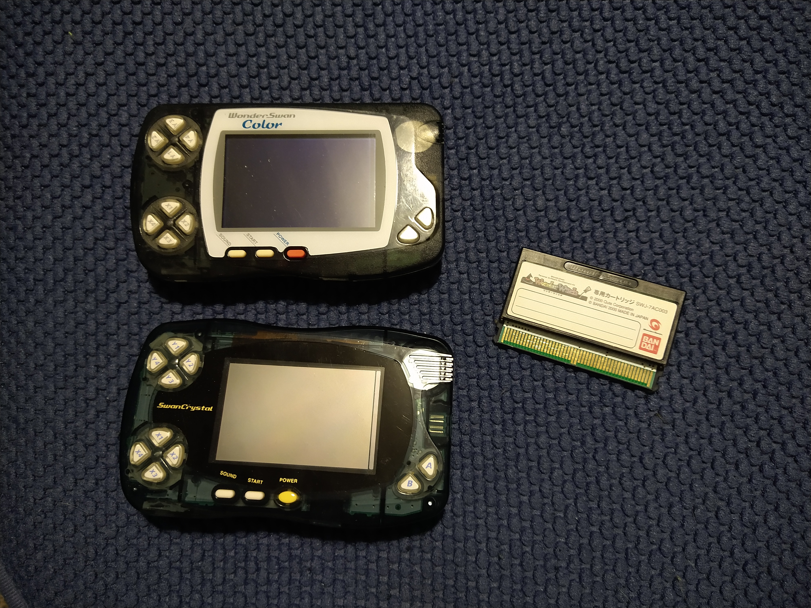
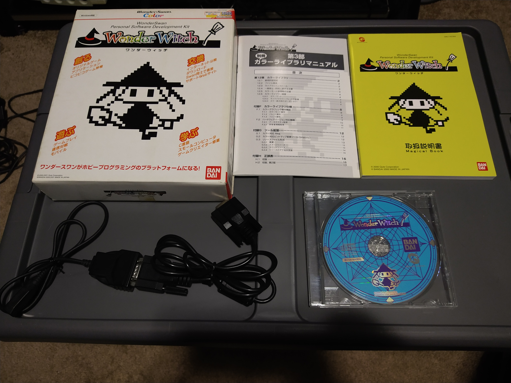
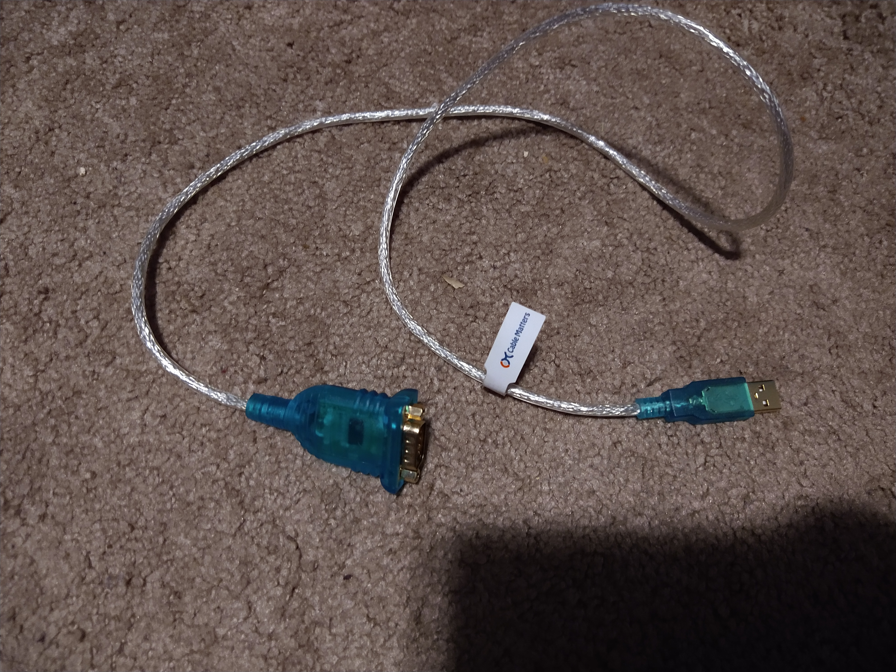
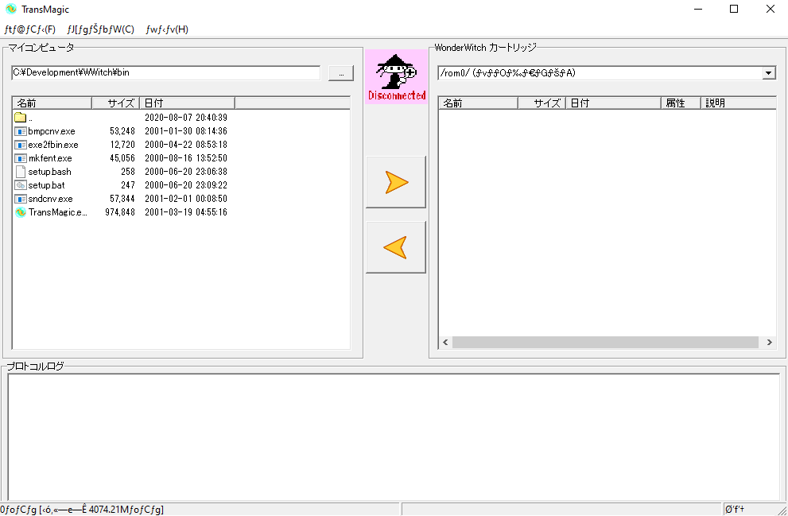
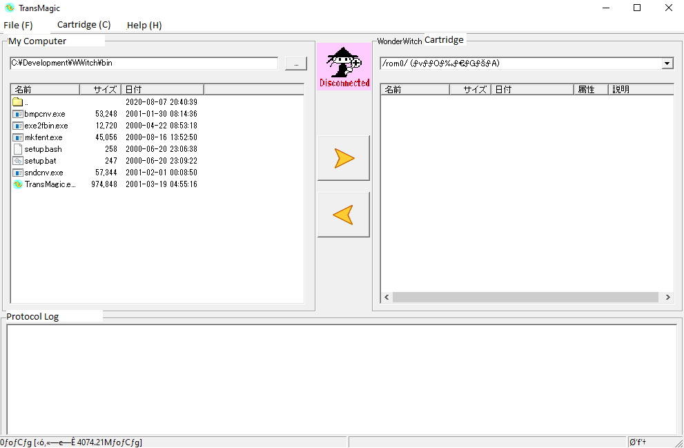

##What is the WonderSwan?

The WonderSwan was a series of short lived handheld game systems released by Bandai only
in Japan back in 1999.  Notably, they were designed by Gunpei Yokoi, and it was hardware he created
before he died.  There are three models - the original WonderSwan, a black and white
console, the WonderSwan Color, which added a color screen, and the SwanCrystal, the final revision
which added a screen with a better response time.

Impressively, the system runs on a single AA battery and gets between 15 and 40 hours of battery life
depending on the revision.  The system was also made to be played both horizontally and
vertically, having a unique design where the left side of the console has two sets of 4 buttons.

While the system wasn't able to dethrone the Game Boy Advance, it still ended up with a fairly
impressive library.

##What is the WonderWitch?

The WonderWitch was an official software development kit released for the system, allowing users
to create their own software using C.

There was even a development contest for the best software.  The winner of the contest was
the game Judgement Silversword, which was released as an actual product.

The kit I have came with the "Magical CD-ROM", which contains the development libraries,
the TransMagic software, TurboC, code samples and more.  Also included in the box are
two manuals for working with the software, a flash cartridge, and a cable to connect the
WonderSwan console to your computer.

##So, why?

I don't know.  This is an old and not terribly popular system, only released in Japan,
which means that working with the WonderSwan and WonderWitch means you'll have to work
with hardware limitations, wade through Japanese documentation, and work in C.  For some
reason, this challenge appeals to me.

##What do you need to start?

Obviously you'll need a WonderSwan console and the WonderWitch kit.  But, since it's 2020
(as of this writing), there are some further considerations to make.  One, your computer
probably does not actually have a port for the cable, which uses a DSUB9 male connector.
So, my solution was to buy a DSUB9 female to USB cable.

Now, the other consideration is that this console is quite old, and like many old games,
the cartridges use batteries; so, if you have a WonderWitch cartridge, there's a good chance
that the battery will be dead.  If so, you'll need to replace it with a CR1616 lithium battery.

##Installing the Software

Both of those things are checked off my list, so it was time to install the software.  But
would it work on Windows 10?  Actually, yes!  On the Magical CD-ROM, there's an executable
to install the contents.  This is a relatively simple process - but, your system may not
display the characters correctly.  This can typically be fixed by changing the display
language on the system to Japanese.  But if you can't read Japanese, then it probably
doesn't matter.  The installer will install the code samples, libraries and needed binaries
to a folder of your choosing.

##Using TransMagic

In the install folder, in the bin folder, is an application called TransMagic.  This is
what actually establishes the connection between the WonderSwan console and your PC
and allows you to transfer files to it.  Even if you have no interest in development,
this is how you can actually put the games and applications from the contests on the
cartridge and play them.

When you actually boot TransMagic, it'll look something like this.

If you see strange characters on the top as I do, you might need to change your display
language to be Japanese.  For whatever reason, this doesn't seem to resolve it when I
try on Windows 10, but I admittedly haven't investigated it too in depth because it's not
a huge deal.  Regardless, here's a version with translations:

This is just a quick translation I've done.  But there's a great, full translation
available on [Reddit's Wonderswan community](https://amp.reddit.com/r/WonderSwan/comments/i31ha4/wonderwitch_transmagicext_translation_to_english/)

Before we can actually communicate with the device, we're going to have to configure
the port it communicates over.  This was originally a serial port connection, so we
have to choose the port.  If you've connected the WonderSwan via the Serial to USB
cable mentioned earlier and powered it on, you should be able to go to the Windows
Device Manager and look under "Ports(COM & LPT)" to find an entry that looks something
like:

    Prolific USB-to-Serial Comm Port (COM5)

Back in the TransMagic application, if you click the File menu, you're given a dropdown
with 6 options.  From top to bottom, those options are:

    Connect
    Disconnect
    Save Log
    Clear Log
    Serial Port Configuration
    Quit

The entry we're interested in is Serial Port Configuration.  There are two combo boxes
in this option - the first one will say something like COM1 and the second one will
probably be set to 38400.  Change the first one to match the value found in your
Device Manager.  You can leave the second one alone.  Click the "OK" button to save.

Now, power the WonderSwan on if you haven't already.  Once WonderWitch boots up, you
should be at the Launcher (ランチャ) screen.  Press the Y4 button on the console to go
to the file manager screen.  Now, back on the PC, click the File menu again and choose
Connect, the first option.

If everything went right, you should see output in the log section at the bottom of
the screen, and on the right side, a listing of the files on the device.  Now, you're
setup to transfer files to and from the WonderSwan! If you just want to test things
out, you can navigate back to the samples folder in the WonderWitch installation
and take a look at some of the applications available there.  A simple one is the
calendar application.  In the calendar folder, there will be a file called **calendar.fx**.
If you click on this file, then click the right arrow to copy it to the WonderWitch,
upon completion, you should be able to return to the WonderSwan, press Y2 to return
to the launcher, then use the X buttons to navigate to the file you copied and press
A to boot it.

If your Magical CD-ROM included the folder WWGP2001, you can explore various entries,
including the famous Judgement Silversword, which you can find at the following path:

    WWGP2001/entry/00072/JUDGE_SS/JUDGE_SS.FX

And that's all there is to it!  In the future, I hope to cover actually compiling
a simple program for the WonderWitch and executing it.